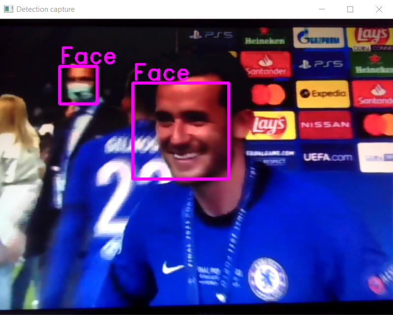
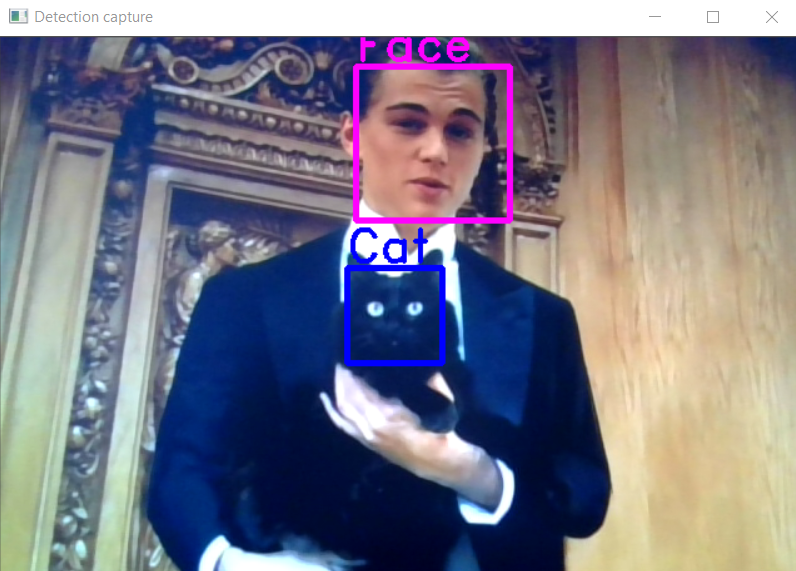

# video-detector

A lightweight real-time object detection on camera input.

## Requirements
* Camera (e.g. simple laptop front camera)
* C++ 11/14(+)
* Windows (Linux)
* OpenCV 4.5.0

## Detection
* Faces
* Cats
* Further objects might follow






Pictures of the detected objects are stored in a newly created detections folder.
```C++
struct stat dirInfo;
if (stat("detections", &dirInfo) != 0) {
  if (_mkdir("detections") != 0) {
    std::cout << "Could not create directory for detections." << std::endl;
    return -1;
  }
}
...
imwrite("detections/face_" + std::to_string(i) + ".png", imgCrop);
```

## Reference
The pretrained cascade classifiers are from [OpenCV](https://github.com/opencv/opencv/tree/3.4/data/haarcascades).

